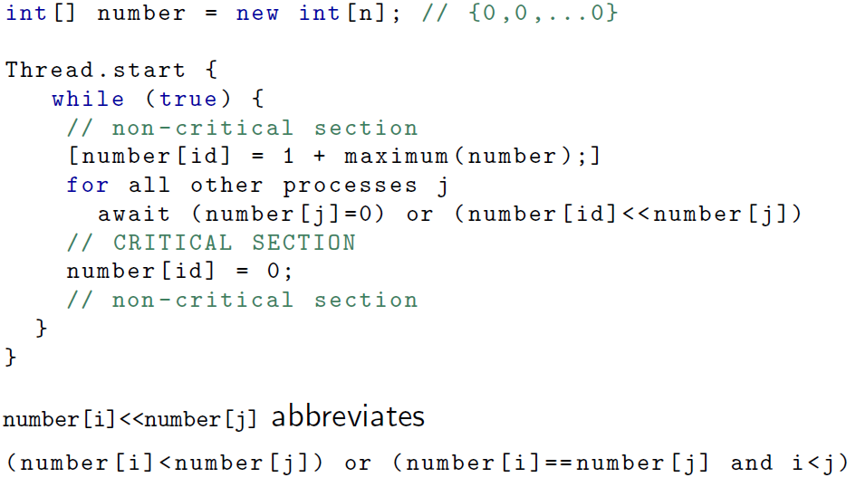

# <center>CS 511 note</center>

## **concurrent programming**
- The study of systems of interacting computer programs which
share resources and run concurrently, i.e. at the same time
- Parallelism
  - Occurring physically at the same time
- Concurrency
  - Occurring logically at the same time, but could be implemented without real parallelism
- If P has m instructions and Q has n instructions, then there are (m+n)!/(m!n!)

## **mutual exclusion**
### **atomic operation**
An operation is atomic if it cannot be interleaved at a lower level of abstraction
- Atomic operations are the smallest units in terms of which a path can be constituted
- In order to reason about concurrency at the source level, we need to know what is assumed atomic at the source level
  - Following Ben-Ari: we assume throughout this course that all (single-line) statements are atomic
  - In particular, assignments such as `counter = counter+1` are assumed atomic
### **LCR(limited critical reference)**
A program satisfies the Limited Critical Reference (LCR) property if every statement contains at most one critical reference
### **MEP(mutual exclusion problem)**
1. Mutex: At any point in time, there is at most one thread in the critical section
2. Absence of livelock: If various threads try to enter the critical section, at least one of them will succeed
3. Free from starvation: A thread trying to enter its critical section will eventually be able to do so
### **await**
    `while(cond){} == await (!cond)`
**await: false to loop, true to continue next excution**
### **attempt 1 take truns**
```
int turn = 1;
Thread . start { // P
    // non - critical section
    await (turn ==1);
    // CRITICAL SECTION
    turn = 2;
    // non - critical section
}
Thread . start { // Q
    // non - critical section
    await (turn ==2);
    // CRITICAL SECTION
    turn = 1;
    // non - critical section
}
```
mutex: yes, absence live lock: yes, Free from startvation:no(a process could remain indefinitely in its non-critical section)
### **Dekker's Algorithm**

### **Peterson's Algorithm**

### **Bakery Algorithm**
People take a ticket from a machine. If nobody is waiting, tickets don't matter. When several people are waiting, ticket order determines order in which they can make purchases
for two threads

If there are multiple threads:


## **Semaphore**
### **Dining Philiosophores**
```
Semaphore[ ] forks = [1,...,1]; //N
Semaphore chairs = new Semaphore(N-1);
```
### **Man/Woman Restroom**
```
import java.util.concurrent.Semaphore;

int man = 0, woman=0;
Semaphore manmutex = new Semaphore(1);
Semaphore womanmutex = new Semaphore(1);
Semaphore toilets = new Semaphore(n);
Semaphore restroom = new Semaphore(1);

Thread.start {
    // man
    manmutex.acquire();
    if(man == 0){
        restroom.acquire(); 
    }
    man++;
    manmutex.release();

    toilets.acquire();
    // man in restroom
    toilets.release();
    
    manmutex.acquire();
    man--;
    if(man==0){
        restroom.release();
    }
    manmutex.release();
}

Thread.start {
    // woman
    womanmutex.acquire();
    if(woman == 0){
        restroom.acquire(); 
    }
    woman++;
    womanmutex.release();

    toilets.acquire();
    // man in restroom
    toilets.release();

    womanmutex.acquire();
    woman--;
    if(woman==0){
        restroom.release();
    }
    womanmutex.release();
}
```
### **Ferry Move**
import java.util.concurrent.Semaphore;

int max=?,cur=0,coast=0;
Semaphore permitOn = new Semaphore(1);
Semaphore permitOff = new Semaphore(0);
Semaphore ferryMove = new Semaphore(0);

Thread.start {
    // ferry
    while(true){
        ferryMove.acquire();
        coast=1-coast;
        // move
        permitOff.release();
    }
}

Thread.start {
    // passengers
    permitOn.acquire();
    cur++;
    if(cur==max){
        ferryMove.release();
    }else{
        permitOn.release();
    }

    permitOff.acquire();
    cur--;
    if(cur==0){
        permitOn.release();
    }else{
        permitOff.release();
    }
}
### three stations to clean car
```
import java.util.concurrent.Semaphore;

Semaphore blast = new Semaphore(1);
Semaphore rinse = new Semaphore(1);
Semaphore dry = new Semaphore(1);

Semaphore waitSet[3] = {new Semaphore(0),new Semaphore(0),new Semaphore(0)};

Thread.start { // car
    waitSet[0].release();
    blast.acquire();
    waitSet[1].release();
    rinse.acquire();
    exwaitSetist[2].release();
    dry.acquire();
}

Thread.start { // blast
    while(true){
        waitSet[0].acquire();
        // do blast
        blast.release();
    }
}

Thread.start { // rinse
    while(true){
        waitSet[1].acquire();
        // do rinse
        rinse.release();
    }
}

Thread.start { //dry
    while(true){
        waitSet[2].acquire();
        // do dry
        dry.release();
    }
}
```
## **Monitor**
synchronized,Condition,monitor  
notify(),notifyAll(),wait()

### **Buffer**
```
class Buffer {
    Object buffer = null; // shared buffer
    synchronized Object consume() {
        while (buffer == null)
            wait(); // wait on object 's wait -set
        Object aux = buffer;
        buffer = null;
        notifyAll(); // signal on object 's wait - set
        return aux;
    }

    synchronized void produce(Object o) {
        while (buffer != null)
            wait(); // wait on object 's wait -set
        buffer = o;
        notifyAll(); // signal on object 's wait - set
    }
}
```
### **Reader/Writers**
```
monitor RW {
  int readers = 0;
  int writers = 0;
  condition OKtoRead , OKtoWrite ;

  public void StartRead () {
    while ( writers != 0 or !OKtoWrite . empty ()) {
      OKtoRead . wait ();
    }
    readers = readers + 1;
  }

  public void EndRead {
    readers = readers - 1;
    if ( readers ==0) {
      OKtoWrite . notify ();
    }
  }
  public void StartWrite () {
    while ( writers != 0 or readers != 0) {
      OKtoWrite . wait ();
    }
    writers = writers + 1;
  }

  public void EndWrite () {
    writers = writers - 1;
    OKtoWrite . signal ();
    OKtoRead . signalAll ();
  }
}
```
It gives priority to readers over writers.

## **Erlang Syntax**
- **Comment** %

- **Variables**: start with upper case letter; **Only bound once**

- **String**
  - Characters: $a, $n
  - String: a list of integers  
    "hello\7" : [104,101,108,111,7]

- **Operators**
  - Arithmetic: +, -, *, /, div (get Integer), rem (mod)
  - Equal value: ==, /= (!=), =:= (type, value), =/= (! ===)
  - Boolean: and, or, xor, not, andalso, orelss

- **Lists**
  - synstax: [ ], [ head | remain ]
  - Operator: ++, --;  
    eg: `L ++ [aa]. ; L -- [aa].`

- **Comparison**  
  number < atom < reference < fun < port < pid < tuple <
map < nil < list < bitstring

- **Function**  
  start with lowercase letter  
  `fun(0) -> 1;`  
  `fun(N) -> when N>0 -> N*fun(N-1);`  
  `fun(_) -> others.`  
  `% _ represent don't care variable`

- **Print**  
  io:format("~p ~p",[Num1,Num2]).  
  io:fwrite("~p ~p",[Num1,Num2]). 

- **Module Complie**  
  - module name should be same like file name without extension  
  .erl file  
  -module(module_name).  
  -compile(export_all).  

- **Type Check**  
  is_atom/1  
  is_function/1  
  is_boolean/1  
  is_record/1 

- **-spec**  
  use this to define a function arguments' type and return type  
  ```
  -spec Function(Arguments_type) -> RT.  
  -spec Function(Arguments::Type) -> RT.
  ```
  init dialyzer: `dialyzer -- build_plt --apps erts kernel stdlib crypto
mnesia sasl common_test eunit`  
  use `dialyzer module_name.erl` to check the function type  
  type expression used in -spec  
  | Syntax            |     Description      |
  | :---------------- | :------------------: |
  | type \| type2     |    type or type2     |
  | term()            |        any()         |
  | boolean()         |  'false' \| 'true'   |
  | byte()            |        0..255        |
  | char()            |     0..16#10ffff     |
  | nil()             |          []          |
  | number()          | integer() - float()  |
  | list()            |       [any()]        |
  | nonempty_list()   | nonempty list(any()) |
  | string()          |       [char()]       |
  | nonempty_string() |     [char(),...]     |
  | function()        |        fun()         |
  | module()          |        atom()        |
  | no_return()       |        none()        |


- **Record**  
  data like json  
  `-record ( record_name , { some_field , some_default = " yeah !", unimaginative_name }).`  
  if record in .hrl file, this should be included in .erl file  
  `-include(module_name.hrl).`  
  e.g:  
  `-record(robot, {name,type=industrial, hobbies, details=[ ] })`  
  `#rebot{name="Mechatron", type = handmade,details = ["Moved by a samll man inside"]}.`  
  `%access field`  
  `variable#rebot.name`

- **Type**  
  define a data structure more convenient than record  
  `-type btree()::{empty}|{node, term(),btree(),btree()}. `

- **Exception**
  `throw(permission_denied).`
  ```
  try Expression of 
    SuccessfulPattern1 [Guards] -> 
        Expression1; 
    SuccessfulPattern2 [Guards] -> 
      Expression2 
  catch 
    TypeOfError:ExceptionPattern1 -> 
      Expression3; 
    TypeOfError:ExceptionPattern2 -> 
      Expression4 
  after
    Expression5
  end
  ```

- **Control Structures**
  ```
  if
    X > Y ->
      true;
    true -> % works as else branch
      false
  end
  ```
  ```
  case expression of
    value1 -> statement#1;
    value2 -> statement#2;
    valueN -> statement#N
  end.
  ```

- **-spawn**  
  creates a new process and returns the pid.
  ```
  spawn(Module, Name, Args) -> pid()
  ```

- **Message Passing**  
  use `flush().` can get message from shell.  
  `PID ! msg` is non-blocking, it will send message `msg` to process PID
  ```
  Pid  ! Message
  % send multiple messages
  Pid1 ! Message, Pid2 ! Message, Pid3 ! Message
  Pid1 ! (Pid2 ! (Pid3 ! Message))
  Pid1 ! Pid2 ! Pid3 ! Message
  ```
  receive blocks until a message is available in the mailbox;
  ```
  receive
    Pattern1 when Guard1 ->
      ToDo1;
    Pattern2 when Guard2 ->
      ToDo2;
    _Other ->
      Catch_all
    after time->
      timeout
    % after part will triggered if time milliseconds have passed without receiving a message that matched the pattern
  end
  ```
  e.g:
  ```
  -module ( echo ).
  -export ([ start /0]).

  echo () ->
    receive
      {From , Msg} ->
        From ! { Msg },
        echo ();
      stop -> true
    end .

  start () ->
    Pid = spawn ( fun echo /0) , 
    % Returns pid of a new process
    % started by the application of echo /0 to []
    Token = " Hello Server !", 
    % Sending tokens to the server
    Pid ! { self (), Token },
    io: format (" Sent ~s~n",[ Token ]),
    receive
      { Msg } ->
      io: format (" Received ~s~n", [Msg ])
    end ,
    Pid ! stop . 
    % Stop server
  ```
  `make_ref().` can get a global reference objects 

- **Semaphore**
  ```
  -module(sem).
  -compile(export_all).

  start_sem(Init) ->
      spawn(?MODULE,sem_loop,[Init]).

  sem_loop(0) ->
      receive
        {release} ->
          sem_loop(1)
      end;
  sem_loop(P) when P>0 ->
      receive
        {release} ->
          sem_loop(P+1);
        {acquire,From} ->
          From!{ack},
          sem_loop(P-1)
      end.

  acquire(S) ->
      S!{acquire,self()},
      receive
        {ack} ->
          done
      end.

  release(S) ->
      S!{release}.
  ```

- **Links**  
  `link(Pid)`  
  `link(spawn(fun module_name:fun_name/N))`    
  `unlink/1` can tear the link down  

- **counter**
```
-module(ex1). 
-compile(export_all).

start(N) -> 
%% Spawns a counter and N turnstile clients
C = spawn(?MODULE ,counter_server ,[0]),
[ spawn(?MODULE ,turnstile ,[C,50]) || _ <- lists:seq(1,N)], 
C.

counter_server(State) -> 
%% State is the current value of the counter 
    receive
	{bump} ->
	    counter_server(State+1);
	{read,From} ->
	    From!State,
	    counter_server(State)
    end.

turnstile(_C,0) -> 
%% C is the PID of the counter, and N the number of  
%% times the turnstile turns
    done;
turnstile(C,N) when N>0 ->
    C!{bump},
    turnstile(C,N-1).
```

**print letter before number**
```
-module(barr).
-compile(export_all).

start(N) ->
    B = spawn(?MODULE,loop,[2,2,[]]),
    spawn(?MODULE,client1,[B]),
    spawn(?MODULE,client2,[B]),
    ok.

% loop(N,M,L) 
% the main loop for a barrier of size N
% M are the number of threads yet to reach the barrier
% L is the list of PID,Ref of the threads that have already reached the barrier

loop(N,0,L) ->
    [ Pid!{ok,Ref} || {Pid,Ref} <- L ],
    loop(N,N,[]);
loop(N,M,L) ->
    receive
        {From,Ref} ->
            loop(N,M-1,[{From,Ref}|L])
end.

reached(B) ->
    R = make_ref(),
    B!{self(),R},
    receive
        {ok,R} ->
	        ok
    end.
     

client1(B) ->
    io:format("a~n"),
    reached(B),
    io:format("1~n").

client2(B) ->
    io:format("b~n"),
    reached(B),
    io:format("2~n").
```

## promela
active spawn a process type. `active protype P(){}`  
`init` is the first process that is activated  
`run`instantiates a process
```
init {
  n = 1;
  atomic {
    run P(1, 10);
    run P(2, 15)
  }
}
```
assert();
```
do
  :: i > N -> break
  :: else ->
    sum = sum + i;
    i++
od;
```
```
for (i : 1 .. N) {
  sum = sum +i;
}
```

**Transition Systems**  


